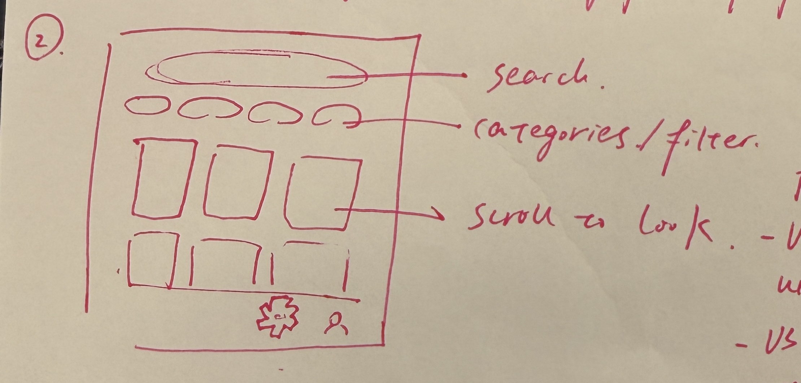
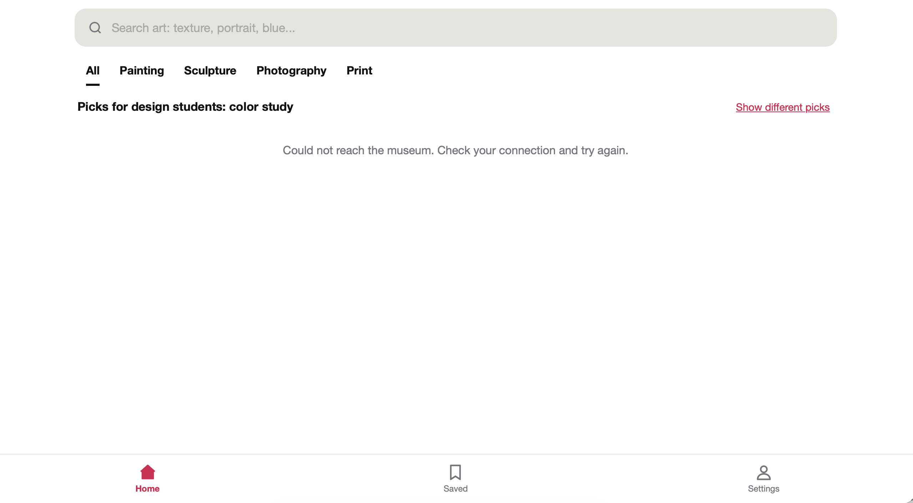

# Day 1 "before" snapshot

Write your own, even if you worked in a pair. Keep it: we come back to it at mid-quarter (Week 6) and at the end (Week 11). Your prompts go in `ai_log.md`, not here.

**Name:**
**Partner (if any):**
I forgot her name
## Before we prompted

### 1. Who is it for, and what do they want to do?

It's for design students at UW who want to look for inspiration for their art assignments.

**"The user can..." sentences:**
1.The user can search for art pieces with input of styles, colors, etc;
2.The user can filter and customize the results they get.

### 2. Our sketch

Put the photo in this `hw0` folder, then change the filename below to match:

### 3. Our prediction

We expected the app would look like Pinterest, where it recommends images on the "Home" page and you can filter your feed by categories. 

## What we got

### 4. What the AI made

Put the screenshot in this `hw0` folder, then change the filename below to match:

### 5. Sketch vs. app

- **Matches our sketch:**
Both include a search bar, filter, and nav bar.
- **Different from our sketch:**
In the sketch, we mentioned we want a scrolling section underneath the filter, but the AI did not display that in the generated app.
- **The AI decided** (something we never said):
The AI decided to mention "Could not reach the museum. Check your connection and try again." instead of displaying recommended art pieces. It also decided the specific icons in nav bar despite we've never mentioned what needs to be inside the nav bar.The AI also applied black and red as the main theme color without us requiring a specific color theme.
### 6. What did I keep, change, or reject, and why?
I asked the AI to add recommended art pieces on the Home page, and include clickable icons that represent: Saved, User/Setting, Home for the nav bar at the bottom.

### 7. Explain back

Pick one part of the code. In your own words, what does it do?
CSS supports the scrollable feed is in side-by-side columns and each art work has large rounded corners.

## Looking ahead

### 8. What does it do? Does it work? What broke?

By providing search box, filter, and save feature, the app allows design students to search and save the inspiration they need for their art work. What isn't working that well is that not all the displayed images match the search input, so it could be a little confusing.

### 9. How much do I understand about how it works? (0–100%)

**My number:** 
10%

**Why that number:**
After reading the plain explanation on Claude, I still don't understand the logic behind how the code itself can form such design.

### 10. What would I need to know to tell whether it's *well designed or well built*?
If it's well designed, people should be able to recognize what all icons and features are for without explanations. Arts students should feel intuitive about flows like saving an image.

### 11. What do I hope to be able to do by week 10?
I hope that by looking at the code, I can understand and explain why the vibe coded result doesn't match my prompt and how to fix it.

